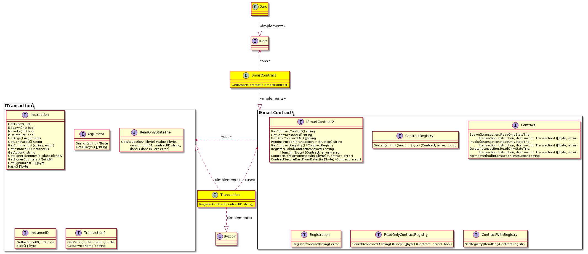

# Smartcoin

An experiment: what would it look like if we took the best parts of Byzcoin and
made them available as loosely coupled modules?

The stack:

```
+----------------------------+
|                            |
| DARC                       |
|                            |
+----------------------------+
|                            |
| Smart contract             |
|                            |
+----------------------------+
|                            |
| Transaction                |
|                            |
+----------------------------+

```

The class diagram:

